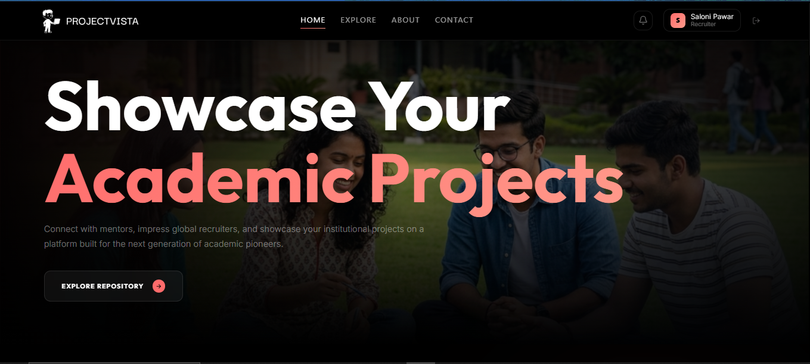

# ProjectVista — Smart College Project Showcase Platform

**ProjectVista** is a simple and powerful platform where students can show off their college projects. It helps students, teachers, recruiters, and admins work together in one place. Students can post their work, teachers can mentor them, and recruiters can find top talent.

---

### Features

- **Personal Dashboards:** Separate areas for Students, Teachers, Recruiters, and Admins to manage their work easily.
- **Weekly Progress Reporting:** Students submit their project updates every week with files and descriptions, allowing mentors to track development.
- **Real-Time Chat:** Project groups can talk to each other instantly using a built-in chat system to coordinate their work.
- **Proposal System:** A clean way for students to submit project ideas and get them approved by teachers.
- **Digital Gallery:** A beautiful list of all approved projects that anyone can browse to find inspiration.
- **Evaluation & Insights:** recruiters can give ratings, feedback, and professional insights on projects.

---

### Dashboards

1. **Student Dashboard:** This is the main hub for students. They can submit project proposals, upload **weekly progress reports**, manage their project files, and chat with their team members in real-time.
2. **Teacher Dashboard:** Teachers act as mentors. They review project proposals, track student progress through weekly submissions, give ratings, and manage the student groups assigned to them.
3. **Admin Dashboard:** The control center where admins manage all user accounts (students, teachers), organize project groups, and oversee the entire platform.

---

### How It Works (Simple Steps)

1. **Join the Platform:** Sign up as a Student, Teacher, or Recruiter. Admins manage the system.
2. **Pitch Your Idea:** Students submit a project proposal detailing their plan.
3. **Get Approved:** A teacher reviews the proposal and approves it to form a project group.
4. **Weekly Updates:** Every week, students submit progress reports (files and text) to show their work.
5. **Team Talk:** Use the real-time group chat to stay connected with team members and mentors.
6. **Final Submission:** Upload the complete project with GitHub links, demo videos, and documentation.
7. **Professional Review:** Teachers and Recruiters check the final project. Recruiters provide ratings while Teachers give final academic approval.
8. **Showcase:** The project appears in the main gallery for the public and other students to see.

---

### Tech Stack

- **Frontend:** Next.js (App Router), React, Tailwind CSS.
- **Backend:** Node.js, Express, Socket.io.
- **Database:** MongoDB with Mongoose.
- **File Handling:** Multer (for project files and weekly reports).

---

### Project Structure

```
college-project-showcase/
├── backend/                 
│   ├── controller/        
│   ├── middleware/      
│   ├── models/            
│   ├── routes/            
│   └── index.js           
├── frontend/                 
│   └── my-app/
│       ├── app/            
│       │   ├── admin-dashboard/     
│       │   ├── student-dashboard/   
│       │   ├── teacher-dashboard/   
│       │   ├── explore/             
│       │   └── view-project/        
│       ├── components/     
│       ├── context/        
│       └── public/        
└── README.md               
```

---

### Getting Started

#### 1. Get the Code
```sh
git clone <repo-link>
cd college-project-showcase
```

#### 2. Setup Settings
Create a `.env` file in the **backend** folder and add:
- `MONGO_URL`: Your MongoDB connection link
- `PORT`: 2021 (or your choice)
- `JWT_SECRET`: A secret key for login

#### 3. Install & Run
```sh
# Terminal 1: Backend
cd backend
npm install
npm start

# Terminal 2: Frontend
cd frontend/my-app
npm install
npm run dev
```

---

### 📸 Demo


*The stunning landing page and hero section.*


---

### 📝 Project Overview for GitHub
**ProjectVista** is a modern Full-Stack MERN application designed for educational institutions to manage student projects efficiently. It features role-based dashboards, automated weekly progress tracking, real-time group discussions using Socket.io, and a beautiful public gallery to showcase student innovations.

---

### Contributing
Feel free to open an issue or send a pull request if you want to help improve ProjectVista!

---
