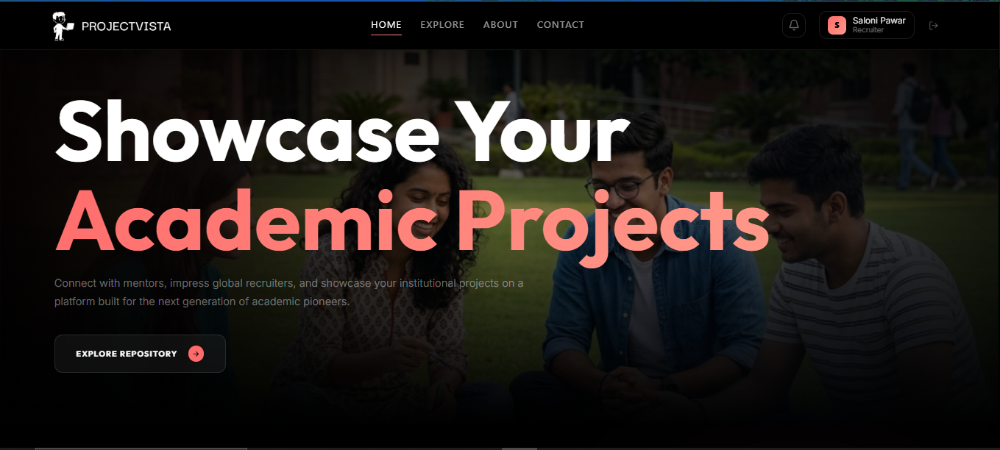
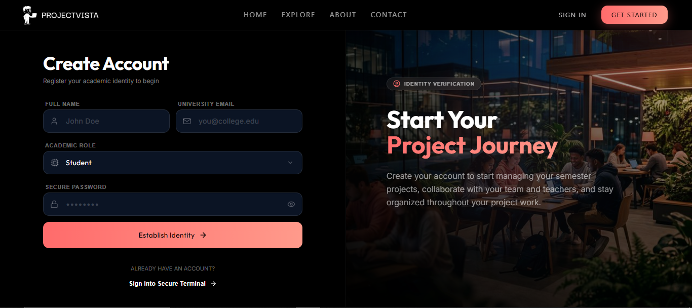
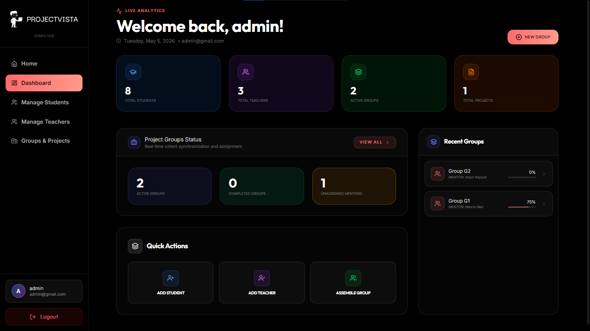
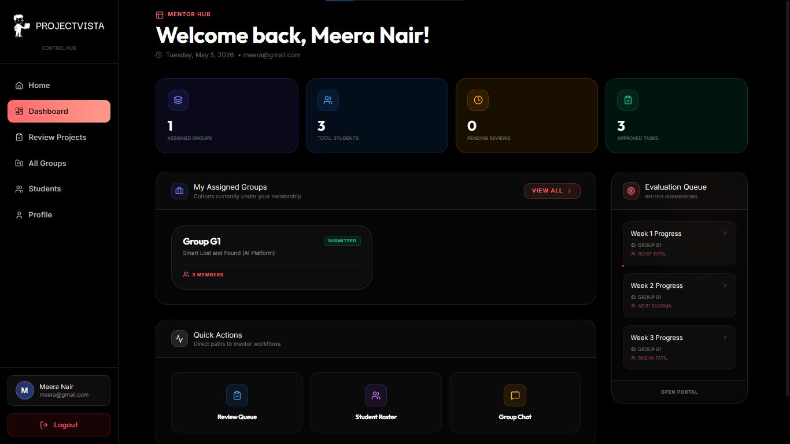
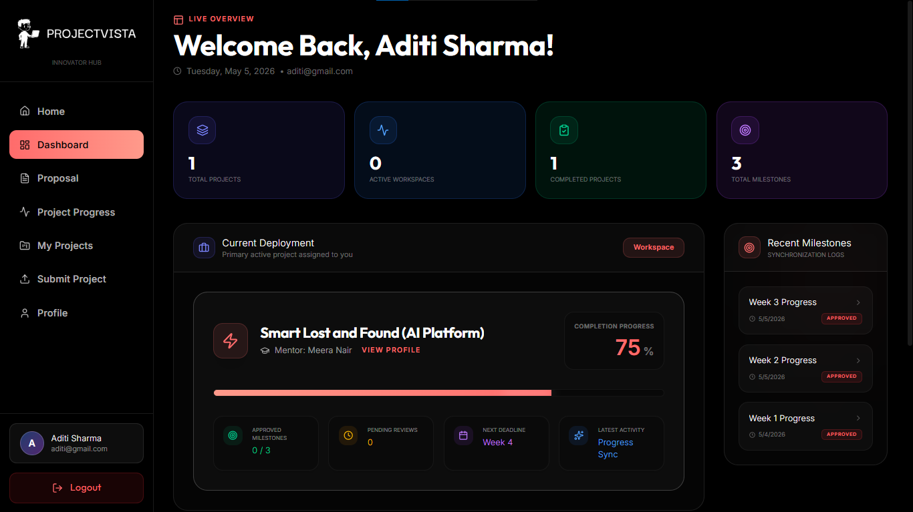
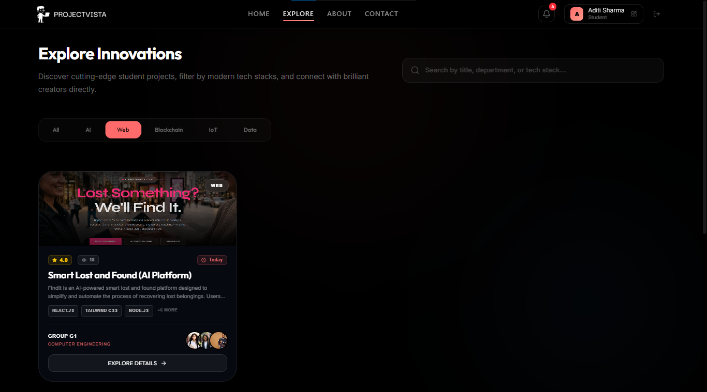
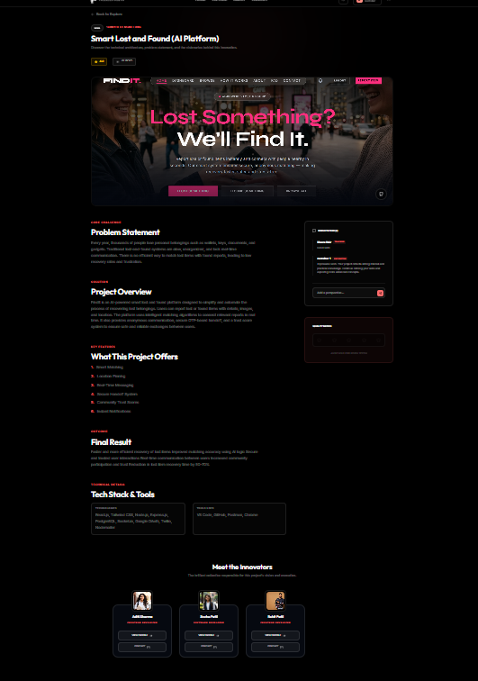

# ProjectVista — Smart College Project Showcase Platform

**ProjectVista** is a simple and powerful platform where students can show off their college projects. It helps students, teachers, recruiters, and admins work together in one place. Students can post their work, teachers can mentor them, and recruiters can find top talent.

---

### 🚀 Try It Live — Demo Access

> Visit the platform and log in instantly with the demo accounts below. No registration needed!

| Role | Email | Password | What You Can See |
|------|-------|----------|-----------------|
| 🛡️ **Admin** | `admin@gmail.com` | `password123` | Manage all users, assign mentors, view all groups & metrics |
| 👩‍🏫 **Teacher** | `meera@gmail.com` | `meera123` | Review proposals, track student progress, give ratings |
| 🎓 **Student** | `aditi@gmail.com` | `password123` | Submit proposals, weekly reports, team chat |

> 💡 **Tip:** Login as all three roles to see how each dashboard is completely different!

---

### Features

- **Personal Dashboards:** Separate areas for Students, Teachers, Recruiters, and Admins to manage their work easily.
- **Weekly Progress Reporting:** Students submit their project updates every week with files and descriptions, allowing mentors to track development.
- **Real-Time Chat:** Project groups can talk to each other instantly using a built-in chat system to coordinate their work.
- **Proposal System:** A clean way for students to submit project ideas and get them approved by teachers.
- **Digital Gallery:** A beautiful list of all approved projects that anyone can browse to find inspiration.
- **Evaluation & Insights:** recruiters can give ratings, feedback, and professional insights on projects.

---

### Dashboards

1. **Student Dashboard:** This is the main hub for students. They can submit project proposals, upload **weekly progress reports**, manage their project files, and chat with their team members in real-time.
2. **Teacher Dashboard:** Teachers act as mentors. They review project proposals, track student progress through weekly submissions, give ratings, and manage the student groups assigned to them.
3. **Admin Dashboard:** The control center where admins manage all user accounts (students, teachers), organize project groups, and oversee the entire platform.

---

### How It Works (Simple Steps)

1. **Join the Platform:** Sign up as a Student, Teacher, or Recruiter. Admins manage the system.
2. **Pitch Your Idea:** Students submit a project proposal detailing their plan.
3. **Get Approved:** A teacher reviews the proposal and approves it to form a project group.
4. **Weekly Updates:** Every week, students submit progress reports (files and text) to show their work.
5. **Team Talk:** Use the real-time group chat to stay connected with team members and mentors.
6. **Final Submission:** Upload the complete project with GitHub links, demo videos, and documentation.
7. **Professional Review:** Teachers and Recruiters check the final project. Recruiters provide ratings while Teachers give final academic approval.
8. **Showcase:** The project appears in the main gallery for the public and other students to see.

---

### Tech Stack

| Layer | Technology |
|---|---|
| **Frontend** | Next.js 14 (App Router), React, Tailwind CSS |
| **Backend** | Node.js, Express.js |
| **Real-Time** | Socket.io (group chat) |
| **Database** | MongoDB, Mongoose |
| **File & Image Uploads** | Cloudinary |
| **Email Notifications** | Brevo (SMTP) |
| **Authentication** | JWT (JSON Web Tokens) |
| **Deployment** | Vercel (Frontend) + Render (Backend) |

---

### Project Structure

```
college-project-showcase/
├── backend/                 
│   ├── controller/        
│   ├── middleware/      
│   ├── models/            
│   ├── routes/            
│   └── index.js           
├── frontend/                 
│   └── my-app/
│       ├── app/            
│       │   ├── admin-dashboard/     
│       │   ├── student-dashboard/   
│       │   ├── teacher-dashboard/   
│       │   ├── explore/             
│       │   └── view-project/        
│       ├── components/     
│       ├── context/        
│       └── public/        
└── README.md               
```

---

### Getting Started

#### 1. Get the Code
```sh
git clone <repo-link>
cd college-project-showcase
```

#### 2. Setup Environment Variables
Create a `.env` file inside the **`backend/`** folder and fill in the following:

```env
# ── Database ──────────────────────────────────────────
MONGO_URL=mongodb+srv://<username>:<password>@cluster0.xxxxx.mongodb.net/college-project-showcase-platform

# ── Server ────────────────────────────────────────────
PORT=2021

# ── Authentication ────────────────────────────────────
JWT_SECRET=your_secret_key_here

# ── Email (Brevo SMTP) ────────────────────────────────
FROM_EMAIL=your_email@gmail.com
BREVO_SMTP_KEY=your_brevo_smtp_key_here

# ── Frontend URL (for CORS & email links) ─────────────
CLIENT_URL=https://your-frontend.vercel.app

# ── Cloudinary (File & Image Uploads) ─────────────────
CLOUDINARY_CLOUD_NAME=your_cloud_name
CLOUDINARY_API_KEY=your_api_key
CLOUDINARY_API_SECRET=your_api_secret
```

> **Where to get these values:**
> | Variable | Where to get it |
> |---|---|
> | `MONGO_URL` | [MongoDB Atlas](https://cloud.mongodb.com) → Connect → Drivers |
> | `JWT_SECRET` | Any random string (e.g. `openssl rand -base64 32`) |
> | `FROM_EMAIL` | Your Gmail address used for sending emails |
> | `BREVO_SMTP_KEY` | [Brevo (formerly Sendinblue)](https://app.brevo.com) → SMTP & API → SMTP Keys |
> | `CLIENT_URL` | Your deployed frontend URL (Vercel / Netlify) |
> | `CLOUDINARY_CLOUD_NAME` | [Cloudinary Dashboard](https://cloudinary.com/console) → Account Details |
> | `CLOUDINARY_API_KEY` | Cloudinary Dashboard → API Keys |
> | `CLOUDINARY_API_SECRET` | Cloudinary Dashboard → API Keys |

#### 3. Frontend Environment Variables
Create a `.env.local` file inside **`frontend/my-app/`** and add:

```env
# ── Backend API URL ───────────────────────────────────
NEXT_PUBLIC_BASE_URL=http://localhost:2021
# For production, change to your Render backend URL:
# NEXT_PUBLIC_BASE_URL=https://your-backend.onrender.com
```

#### 4. Install & Run
```sh
# Terminal 1: Backend
cd backend
npm install
npm start

# Terminal 2: Frontend
cd frontend/my-app
npm install
npm run dev
```

The app will be running at **http://localhost:3000**

---

### 🌐 Deployment

| Service | Purpose | Link |
|---|---|---|
| **Vercel** | Frontend (Next.js) | [vercel.com](https://vercel.com) |
| **Render** | Backend (Node/Express) | [render.com](https://render.com) |
| **MongoDB Atlas** | Database | [cloud.mongodb.com](https://cloud.mongodb.com) |
| **Cloudinary** | File & image storage | [cloudinary.com](https://cloudinary.com) |

> ⚠️ On Render/Vercel, set all environment variables from Step 2 & 3 in the platform's **Environment Variables** settings panel.

---


### 📸 Platform Screenshots

Below is a full walkthrough of the platform — from the landing page to every role-based dashboard.

---

#### 🏠 Landing Page

*The hero section welcomes visitors and explains the platform's purpose.*

---

#### 🔐 Login — Role-Based Access

*Users select their role (Student / Teacher / Admin) and sign in. Each role unlocks a completely different dashboard.*

---

#### 🛡️ Admin Dashboard

*Admins have a bird's-eye view of the entire platform — manage users, assign mentors, track all groups, and monitor project health metrics.*

---

#### 👩‍🏫 Teacher Dashboard

*Teachers review student proposals, track weekly progress submissions, give ratings, and communicate with their assigned project groups.*

---

#### 🎓 Student Dashboard

*Students submit project proposals, upload weekly progress reports with files, and chat with teammates in real-time — all from one place.*

---

#### 🌐 Explore — Public Project Gallery

*Anyone can browse the gallery of approved, completed projects — no login needed.*

---

#### 📁 Project View

<p align="center">
  
</p>

*Each project has a detailed page showing the team, tech stack, GitHub link, demo video, and recruiter evaluations.*

---

### 👤 Author
Saloni Pawar
---


